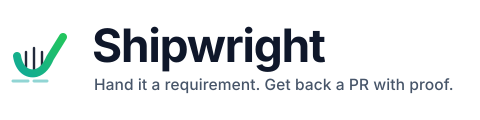
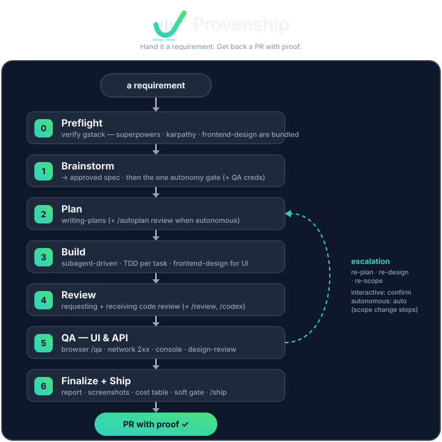

<p align="center">
  <picture>
    <source media="(prefers-color-scheme: dark)" srcset="assets/logo-dark.svg">
    
  </picture>
</p>

<p align="center">
  <a href="LICENSE"></a>
  <a href="https://github.com/RudreshNarwal/provenship/actions/workflows/lint.yml"></a>
  
  
</p>

<p align="center"><b>Hand it a requirement, get back a PR with proof.</b></p>

**Provenship** is a [Claude Code](https://docs.anthropic.com/en/docs/claude-code) skill that drives a
feature or bugfix from one sentence to a shipped pull request — through a disciplined, end-to-end
pipeline that brainstorms, plans, builds with TDD, reviews, runs browser QA against the **real API**,
writes an evidence-rich finalize report, and opens the PR. It runs interactively, or **fully
autonomously** from a single requirement after one approval.

No half-baked diffs. No skipped tests. No "works on my machine." Just high-quality,
evidence-backed pull requests.

It's an **orchestrator**: each phase invokes a battle-tested skill and waits for it to finish. The
discipline comes from [Andrej Karpathy's rules for LLM coding](https://x.com/karpathy/status/2015883857489522876)
— *don't assume, simplicity first, surgical changes, goal-driven* — propagated into every phase and
every subagent prompt.

---

## 🏗️ The Provenship pipeline

Provenship doesn't just write code — it runs a strict engineering lifecycle, every time:

```
[🧠 Brainstorm] ➔ [📋 Plan] ➔ [🧪 TDD Build] ➔ [🔍 Review] ➔ [🌐 Browser+API QA] ➔ [📊 Finalize] ➔ [🚀 PR]
```

- **`0` 🔍 Preflight** — verifies dependencies before doing anything (gstack must be installed;
  superpowers, karpathy, and frontend-design are bundled).
- **`1` 🧠 Brainstorm** — deconstructs the requirement, maps edge cases, and agrees on an approach
  → an **approved spec**.
- **`2` 📋 Plan** — generates a detailed, step-by-step implementation plan *before* touching files
  (auto-reviewed via `/autoplan` when running autonomously).
- **`3` 🧪 Build (TDD)** — writes failing tests *first*, then the minimal clean code to pass them,
  with Karpathy discipline injected into every subagent prompt and `frontend-design` for UI work.
- **`4` 🔍 Review** — self-reviews the diff for correctness, security, and style (+ `/review`,
  `/codex` for an adversarial second opinion).
- **`5` 🌐 Browser + API QA** — drives a headless browser to verify the UI *and* asserts the real
  API calls returned `2xx` via `browse network` (no blind mocking) — plus `/design-review`.
- **`6` 📊 Finalize + 🚀 Ship** — produces a committed report (screenshots + per-stage cost table),
  passes a soft gate, and opens a structured, review-ready pull request.

<p align="center">
  
</p>

<details>
<summary>Text version</summary>

```
requirement
    │
    ▼
[0] Preflight ──── verify gstack is installed (superpowers + karpathy + frontend-design are bundled)
    │
    ▼
[1] Brainstorm ─── provenship:brainstorming → approved spec          ◀─┐
    │              └─▶ Autonomy gate: "run autonomously?" + QA creds   │
    ▼                                                                  │ re-scope
[2] Plan ───────── provenship:writing-plans (+ /autoplan when auto)  ◀─┤
    │                                                                  │ re-plan / re-design
    ▼                                                                  │
[3] Build ──────── provenship:subagent-driven-development · TDD · provenship:frontend-design for UI
    │              karpathy discipline embedded in every subagent prompt
    ▼                                                                  │
[4] Review ─────── provenship:requesting-code-review + receiving-code-review (+ /review, /codex)
    │                                                                  │
    ▼                                                                  │
[5] QA ─────────── gstack /qa · browse network (API 2xx) · console --errors · /design-review
    │              └─ finding bigger than a local fix? escalate ───────┘
    │                 (interactive: confirm first · autonomous: auto, scope-change stops)
    ▼
[6] Finalize ───── report + screenshots + per-stage cost table → soft gate → gstack /ship → PR
    │
    ▼
   PR with proof
```

</details>

Already have a spec or a plan? Provenship's **entry map** starts you at the right phase instead of
redoing finished work. And when Phase 5 surfaces a finding bigger than a local fix, it **loops back**
to the phase that owns it (re-plan or re-design that slice) instead of patching forward.

## ⚡ Quick start

**Requirements:** [Claude Code](https://docs.anthropic.com/en/docs/claude-code) ·
[gstack](https://github.com/garrytan/gstack) (used in Phases 5–6) · `frontend-design` (bundled; only
for UI work). gstack needs [Bun](https://bun.sh/) and a Playwright browser — the bootstrapper below
installs both for you.

### 📦 Option A — plugin (recommended)

```
/plugin marketplace add RudreshNarwal/provenship
/plugin install provenship
```

That's it for the bundled skills. gstack is the one dependency that can't be bundled — on the next
session, Provenship **auto-detects** whether it's installed and prints a one-line install command if
it's missing. To install it (one command — also brings Bun + Playwright):

```bash
bash <(curl -fsSL https://raw.githubusercontent.com/RudreshNarwal/provenship/main/scripts/install-gstack.sh)
# …or, from a clone:  bash scripts/install-gstack.sh
```

**Auto-install (opt-in):** set `PROVENSHIP_AUTO_INSTALL_GSTACK=1` and Provenship installs gstack for
you in the background on session start (idempotent; re-run the command above if it's interrupted).
It's opt-in by design — it downloads ~1 GB plus a browser, so we don't do it silently without your
say-so.

### 📂 Option B — copy the skills

```bash
git clone https://github.com/RudreshNarwal/provenship.git
cp -R provenship/skills/* ~/.claude/skills/
bash provenship/scripts/install-gstack.sh        # installs Bun + gstack + Playwright
```

The bootstrapper (`scripts/install-gstack.sh`) is idempotent and installs, in order: **Bun** (if
missing), the **gstack** clone + its `./setup`, and **Playwright's Chromium**. Add `--yes` to run it
non-interactively. Phase 0 also checks for gstack before any QA/ship work and stops with instructions
if it's still missing.

### 🤖 Other harnesses — Codex & OpenCode

Provenship is built and verified on Claude Code, but the front half of the pipeline runs anywhere with
a real skill + subagent model. Two adapters ship in the repo so it installs cleanly:

**Codex** — `.codex-plugin/plugin.json` reuses the same `skills/`:

```
codex plugin marketplace add RudreshNarwal/provenship
```

Then in Codex open `/plugins`, select the Provenship marketplace, and install Provenship. Open
`/hooks`, review and trust its SessionStart hook (the gstack preflight check), and start a new thread.

**OpenCode** — run from a checkout of this repo (the plugin reuses its `skills/` and `scripts/`), and
add to `opencode.json`:

```json
{ "plugin": ["./.opencode/plugins/provenship.mjs"] }
```

The plugin runs the gstack preflight on session start; OpenCode is expected to discover the bundled
`skills/` from the checkout (unverified — see the capability matrix).

> Install gstack the same way on both (`scripts/install-gstack.sh`) **if** you want Phases 5–6 there —
> but see the capability matrix: gstack is Claude-Code-only, so QA/ship don't yet run on Codex or
> OpenCode.

### 📊 Capability matrix

| Phase | Claude Code | Codex | OpenCode |
|---|:---:|:---:|:---:|
| 1 Brainstorm · 2 Plan · 3 Build · 4 Review | ✅ | ✅ | ✅ |
| 5 Browser QA · 6 Ship (gstack) | ✅ | ⚠️¹ | ⚠️¹ |
| Per-stage cost table (`cost-table.py`) | ✅ | ❌² | ❌² |

¹ gstack (browser + API QA, design review, ship) is a Claude-Code-only product — on Codex/OpenCode,
run Phases 1–4 and ship by hand. ² `cost-table.py` reads Claude Code session transcripts
(`~/.claude/projects/.../*.jsonl`); it produces no output on other harnesses.

### 🚀 Run it

```
/provenship
```

…or just hand Claude a requirement and say "run this end-to-end with provenship." After the spec is
approved you'll be asked once whether to continue autonomously and for any QA login credentials
(leave blank and it self-registers a throwaway test account against non-prod targets).

Curious what the output looks like? See [`docs/example-report/`](./docs/example-report/) for a
template of the evidence-rich report Phase 6 commits — screenshots per feature, the assumptions the
run made, and the per-stage cost table.

## ⚡ What makes the output different

- **API-level QA, not just screenshots.** Phase 5 runs `browse network` after every key flow — a
  pretty UI that silently 4xx/5xx's is a bug, and Provenship catches it.
- **Evidence, not vibes.** Every run ends with a committed finalize report: health score,
  screenshots, the assumptions it made, and a per-stage token/cost table.
- **Autonomous when you want it.** Answer one question after brainstorming and it runs to a PR with
  zero further prompts, taking the safer interpretation at each fork and logging it.
- **Discipline that survives subagents.** Fresh subagents inherit no context, so the "don't assume"
  rules are injected into each implementer prompt — unstated assumptions are treated as a failed review.

## 🔁 Before / after

Same agent, same requirement — the difference is what shows up in the pull request.

**Before** — a PR you have to babysit:

- A green diff you still have to read line by line to trust.
- "It works on my machine" — no proof the UI was ever opened.
- The API layer untested; a clean-looking screen that 4xx's on submit slips through.
- No record of what the agent assumed, or what the run cost.
- When QA finds a bug, the agent patches *forward* — band-aiding around a wrong decision.

**After** — a PR that arrives with its homework done:

- A committed finalize report: one screenshot **per feature**, proving each one runs.
- `browse network` evidence that the real API calls fired and returned 2xx — not just pixels.
- The assumptions the run made, written down, plus a per-stage token/cost table.
- A QA finding that's bigger than a local fix is **classified** and routed back to re-plan or
  re-design that slice — the diff fixes the root, not the symptom.
- A soft gate that refuses to ship over failed tests or low QA health without your say-so.

## 📊 The numbers

Provenship doesn't ship fabricated benchmarks. The numbers here come from a real benchmark harness
([`benchmarks/`](./benchmarks/)) that runs a control-vs-treatment experiment — the same model and
tasks, with Provenship's minimal-code build discipline injected into the treatment arm only — and
records what actually happened. They land here once the harness banks enough runs to clear its
publish gate (N ≥ 10 per arm across the suite, with matched pass-rates).

| Metric | Status |
|---|---|
| Tokens per run (per phase) | Coming from real runs — measured exactly from session transcripts. |
| Dollars per run | Coming from real runs — a flagged **estimate**, not authoritative. |
| Code reduction (median, with N) | Coming from real runs — reported as a median with the sample size. |

> **Tokens are exact; dollars are an estimate.** Token counts are read straight from the transcripts.
> Dollar figures are a rough best-effort estimate, sanity-checked against `/cost` — treat the dollars
> as ballpark, the tokens as real.

Full method, task suite, and raw runs live in
[`benchmarks/METHODOLOGY.md`](./benchmarks/METHODOLOGY.md). Until the gate is cleared, assume there
are no numbers worth quoting — and don't quote any.

## 📦 What's bundled

Provenship vendors a pinned, permissively-licensed snapshot of the skills it orchestrates (all MIT,
plus one Apache-2.0 skill — `frontend-design`), so it installs as one self-contained plugin. gstack is
the exception — it's a separate product you install once. Full provenance and versions are in
[`VENDORED.md`](./VENDORED.md).

## ❓ FAQ

**How is this different from just running a coding agent?**
A normal agent gives you a diff and a summary. Provenship drives a fixed six-phase pipeline
(brainstorm → plan → build with TDD → review → browser + API QA → finalize) and hands back a PR with
proof: per-feature screenshots, evidence the real API calls returned 2xx, the assumptions it made,
and a per-stage cost table. When QA finds a bug bigger than a local fix, it backs up and re-plans
that slice instead of patching forward.

**Is it affiliated with Anthropic?**
No. Provenship is an independent, community plugin *for* Claude Code. "Claude" and "Claude Code" are
trademarks of Anthropic; Provenship is not built, owned, or endorsed by them.

**Does it work without gstack?**
Partly. Phases 1–4 (brainstorm, plan, build, review) run on the bundled superpowers/karpathy skills
and need no gstack. Phases 5–6 (browser + API QA, design review, ship) call gstack — without it,
Phase 0 stops and tells you to install it. You can still run the front half and ship by hand.

**Can I start mid-pipeline?**
Yes. Provenship has an entry map: hand it an approved spec and it starts at Plan; hand it a plan and
it starts at Build; hand it finished code and it starts at Review. It won't redo work whose artifact
already exists.

**What's the autonomy gate?**
After the spec is approved, Provenship asks once: run the rest autonomously, and any QA login
credentials. Say yes and it runs to a PR with zero further prompts — taking the safer interpretation
at each fork and logging it. The only things that still stop an autonomous run are missing
credentials, a failed soft gate, and a genuine "we built the wrong thing" scope flaw (which always
surfaces).

**How are the cost numbers computed?**
From the session transcripts, bucketed per phase. **Token counts are exact; dollar figures are a
flagged estimate**, sanity-checked against `/cost` — treat the dollars as ballpark, the tokens as
real.

**Will it commit my credentials?**
Never. QA credentials live in a gitignored file; only the finalize report and screenshots get
committed, with secrets redacted.

**Does it work on Codex, OpenCode, or other agent tools?**
Provenship is built and verified on Claude Code, but **Codex and OpenCode both have a real skill +
subagent model**, so the front half of the pipeline rides those skills. Adapters for both ship in the
repo — see [Other harnesses](#-other-harnesses--codex--opencode) and the
[capability matrix](#-capability-matrix) for install steps and exactly what runs where. In short:
**Phases 1–4 (brainstorm, plan, build, review) work on Codex and OpenCode**; two things stay
Claude-Code-only — gstack (Phases 5–6: browser + API QA, design review, ship, a separate product),
and `cost-table.py` (it reads Claude Code session transcripts, so the cost table won't populate).
Claude Code remains the fully-supported target; the Codex/OpenCode adapters are provided but
unverified end-to-end. Cursor, Copilot, and Kiro are further off — they lack an
equivalent skill + subagent model.

## 🙏 Credits

Provenship stands on the shoulders of several excellent open-source projects:

- **[superpowers](https://github.com/obra/superpowers)** by Jesse Vincent (MIT) — brainstorming,
  planning, TDD, subagent-driven development, code review, debugging, verification.
- **[gstack](https://github.com/garrytan/gstack)** by Garry Tan (MIT) — the browser QA, design
  review, autoplan, and ship tooling.
- **[andrej-karpathy-skills](https://github.com/forrestchang/andrej-karpathy-skills)** by forrestchang
  (MIT) — the behavioral guidelines that anchor the discipline.
- **[frontend-design](https://github.com/anthropics/claude-plugins-official/tree/main/plugins/frontend-design)**
  by Anthropic (Apache-2.0) — the frontend design skill used for UI work.
- **[ponytail](https://github.com/DietrichGebert/ponytail)** by DietrichGebert (MIT) —
  *inspiration, not bundled.* Its explicit "does this need to exist / stdlib / platform / existing
  dep / one line" build ladder shaped the checklist Provenship injects into each Build-phase prompt.

## 📄 License & attribution

Provenship itself is **MIT © 2026 Rudresh Narwal**.

It bundles, verbatim and version-pinned, skills under two permissive licenses — **MIT** (superpowers,
andrej-karpathy-skills) and **Apache-2.0** (`frontend-design`, © Anthropic). Each upstream's full
license text is preserved in [`licenses/`](./licenses/), and provenance is documented in
[`VENDORED.md`](./VENDORED.md). The Apache-2.0 skill remains under Apache-2.0; bundling it does not
relicense it.

> **Not affiliated with Anthropic.** "Claude" and "Claude Code" are trademarks of Anthropic.
> Provenship is an independent, community plugin *for* Claude Code — it is not built, owned, or
> endorsed by Anthropic.
